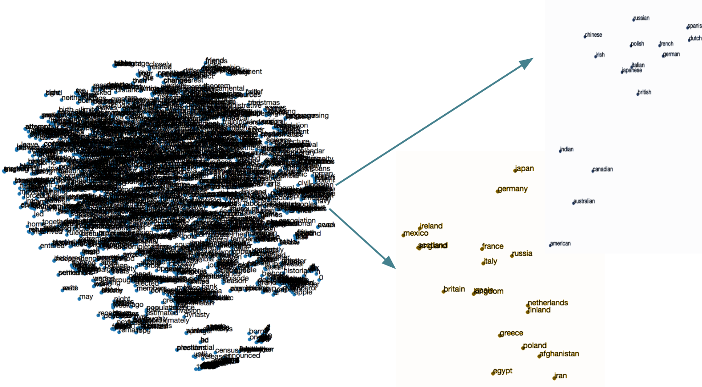
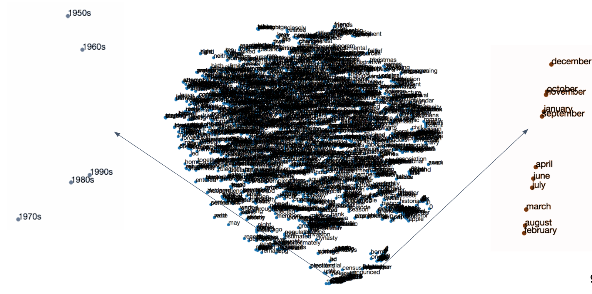
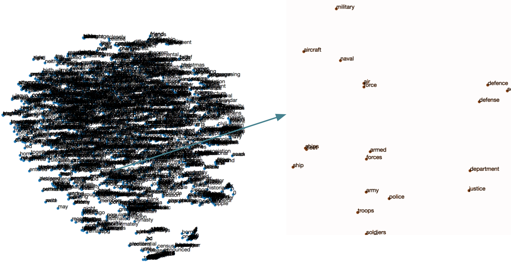
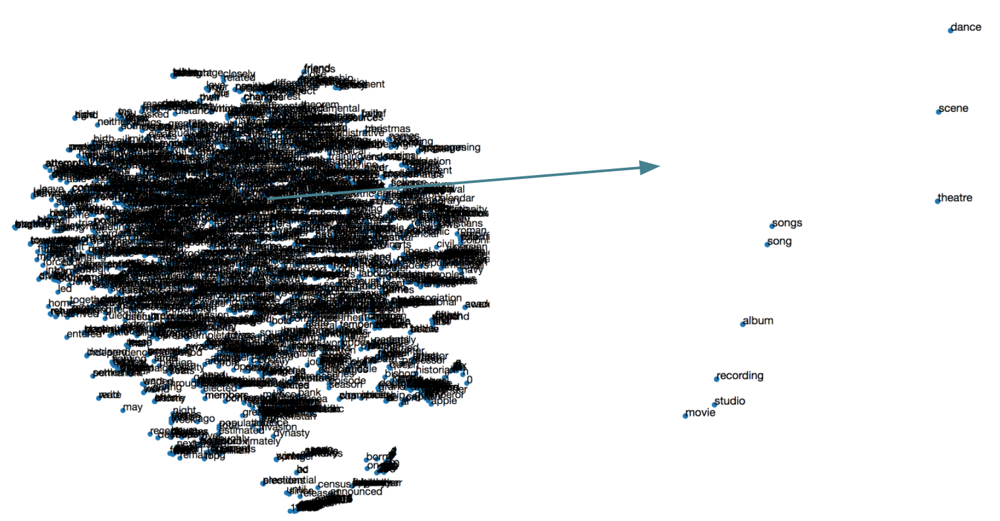

# GloVe

This implementation is based is based on the following paper. 
https://nlp.stanford.edu/pubs/glove.pdf

Several clusters appear after running the pipeline on wikipedia data. 

## Countries & Languages Cluster 

## Cluster of years and months

## Cluster of military terms 

## Cluster of musical terms 

